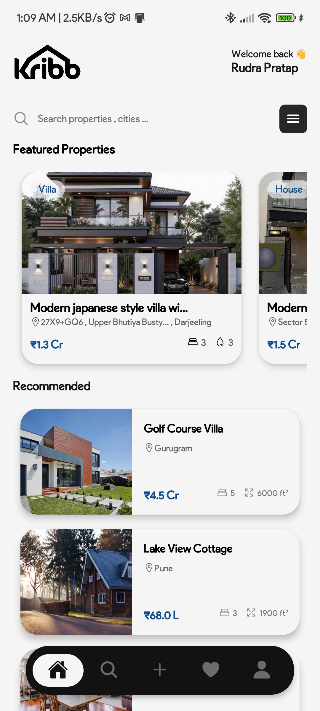
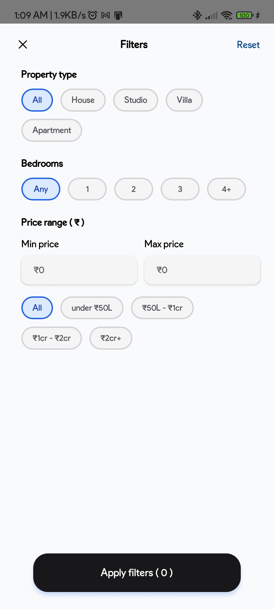
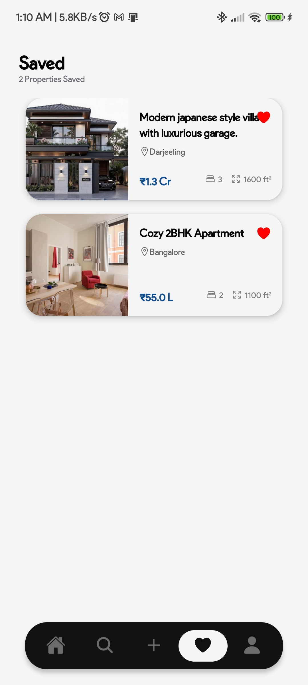
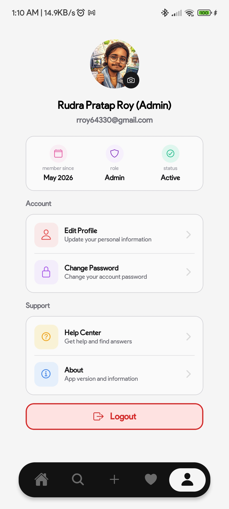
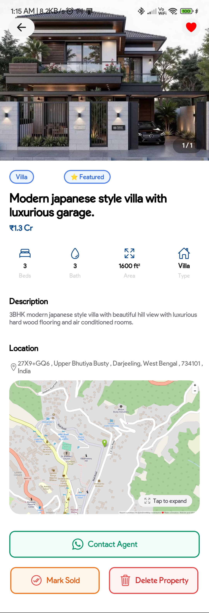
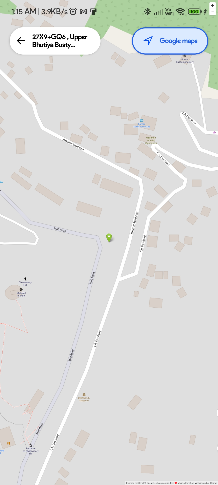
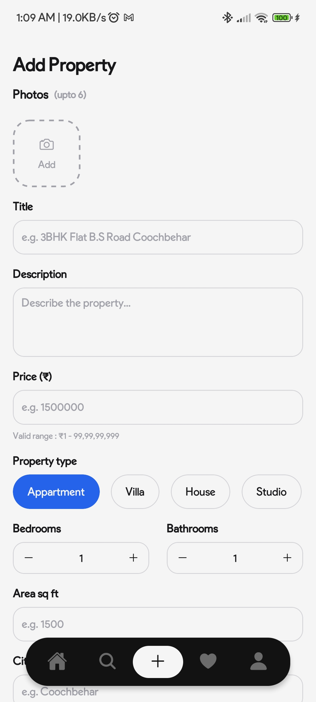
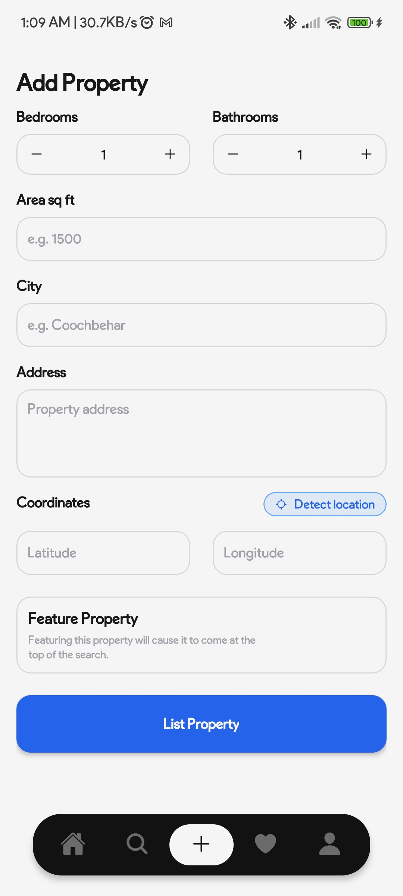

# Kribb


<p align="center">
  <strong>A Modern Real Estate Platform Built with React Native, Expo, Clerk & Supabase</strong>
</p>

<p align="center">
  
  
  
  
</p>

---

## ✨ Features

- 🔐 Clerk Authentication
- 🏠 Browse Properties
- 🔍 Advanced Search
- ❤️ Save Listings
- 👤 Profile Management
- 👑 Admin Dashboard
- ☁️ Supabase Backend
- 📱 Beautiful UI
- 💬 WhatsApp Agent Contact

---

## 📱 Screenshots

### Home


### Search


### Saved


### Profile


### Property Details


### Map


## 📱 Create Property Screenshots

### Create Property


---

# 🚀 Getting Started

## Clone Repository

```bash
git clone <repository-url>
cd kribb
```

## Install Dependencies

```bash
npm install
```

## Start Development Server

```bash
npx expo start
```

---

# 🔑 Environment Variables

Create a `.env` file in the root directory.

```env
EXPO_PUBLIC_CLERK_PUBLISHABLE_KEY=

EXPO_PUBLIC_SUPABASE_URL=
EXPO_PUBLIC_SUPABASE_KEY=

EXPO_PUBLIC_AGENT_WHATSAPP_NUMBER=
```

## Required Variables

| Variable | Description |
|-----------|-------------|
| EXPO_PUBLIC_CLERK_PUBLISHABLE_KEY | Clerk Publishable Key |
| EXPO_PUBLIC_SUPABASE_URL | Supabase Project URL |
| EXPO_PUBLIC_SUPABASE_KEY | Supabase Anon Key |
| EXPO_PUBLIC_AGENT_WHATSAPP_NUMBER | Agent WhatsApp Number |

> ⚠️ The application will not function properly without these variables.

---

# 🗄️ Database Setup

## Users Table

```sql
create table users (
  id uuid primary key default gen_random_uuid(),
  created_at timestamptz default now(),
  first_name text,
  last_name text,
  clerk_id text unique not null,
  email text unique not null,
  is_admin boolean default false,
  avatar_url text
);
```

## Properties Table

```sql
create table properties (
  id uuid primary key default gen_random_uuid(),
  created_at timestamptz default now(),

  title text not null,
  description text,

  price numeric not null,

  bedrooms int2,
  bathrooms int2,

  area_sqft int4,

  address text,
  city text,

  latitude float8,
  longitude float8,

  images text[],

  is_sold boolean default false,
  is_featured boolean default false,

  type text
);
```

## Saved Properties Table

```sql
create table saved_properties (
  id uuid primary key default gen_random_uuid(),
  created_at timestamptz default now(),

  user_clerk_id text not null,
  property_id uuid references properties(id) on delete cascade
);
```

---

# 📦 Storage Setup

Create a bucket named:

```text
kribb-property-images
```

Bucket Settings:

- Public Bucket ✅
- Image Uploads Only
- Used for Property Images

---

# 🔒 Row Level Security (RLS)

## Users Policies

```sql
alter table users enable row level security;

create policy "Users can insert own row"
on users for insert
with check (clerk_id = auth.jwt()->>'sub');

create policy "Users can read own row"
on users for select
using (clerk_id = auth.jwt()->>'sub');

create policy "Users can update own row"
on users for update
using (clerk_id = auth.jwt()->>'sub');
```

## Properties Policies

```sql
alter table properties enable row level security;

create policy "Properties are publicly readable"
on properties for select
using (true);
```

### Admin Property Management

```sql
create policy "Admin can insert properties"
on properties for insert
with check (
  exists (
    select 1 from users
    where clerk_id = auth.jwt()->>'sub'
    and is_admin = true
  )
);

create policy "Admin can update properties"
on properties for update
using (
  exists (
    select 1 from users
    where clerk_id = auth.jwt()->>'sub'
    and is_admin = true
  )
);

create policy "Admin can delete properties"
on properties for delete
using (
  exists (
    select 1 from users
    where clerk_id = auth.jwt()->>'sub'
    and is_admin = true
  )
);
```

## Saved Properties Policies

```sql
alter table saved_properties enable row level security;

create policy "Users can read own saved properties"
on saved_properties for select
using (user_clerk_id = auth.jwt()->>'sub');

create policy "Users can insert saved properties"
on saved_properties for insert
with check (user_clerk_id = auth.jwt()->>'sub');

create policy "Users can delete own saved properties"
on saved_properties for delete
using (user_clerk_id = auth.jwt()->>'sub');
```

## Storage Policies

```sql
create policy "Admin can upload property images"
on storage.objects for insert
with check (
  bucket_id = 'kribb-property-images'
  and exists (
    select 1 from users
    where clerk_id = auth.jwt()->>'sub'
    and is_admin = true
  )
);
```

```sql
create policy "Public can view property images"
on storage.objects for select
using (
  bucket_id = 'kribb-property-images'
);
```

---

# 👑 Creating an Admin

```sql
update users
set is_admin = true
where email = 'your-email@example.com';
```

Admins can:

- Create Properties
- Update Properties
- Delete Properties
- Upload Property Images

---

# 📂 Project Structure

```text
app
├── (auth)
├── (root)
│   ├── (tabs)
│   ├── account
│   ├── property
│   └── support
├── _layout.tsx
└── +not-found.tsx
```

---

# ❤️ Built With

- React Native
- Expo Router
- Clerk
- Supabase
- NativeWind
- Zustand
- TypeScript

---

# 👨‍💻 Developer

### Rudra Roy

If you found this project useful, please consider giving it a ⭐ on GitHub.

Built with ❤️ using React Native & Expo.
